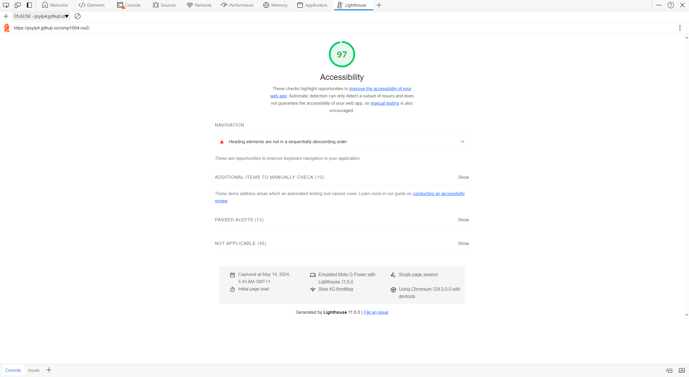

  <h1 style="text-align: center">COMP1004 Coursework 2</h1>
  <h6 style="text-align: center">Name: Lucas Panjaitan</h6>
  <h6 style="text-align: center">Student ID: 20547128</h6>

### HTML
- [index](index.html)
- [search-vehicles](search-vehicles.html)
- [add-vehicle](add-vehicle.html)

### CSS
- [styles](styles.css)

### Javascript
- [script](script.js)

### Accessibility Test

  

